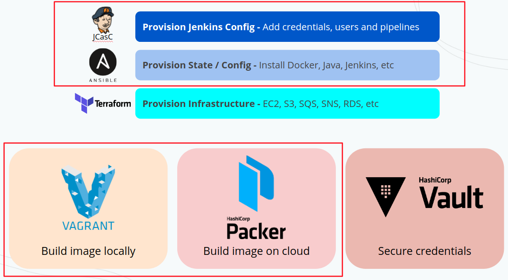

# Jenkins As Code

This is a project that deploys a fully configured Jenkins master node either to Vagrant (locally) or Packer (AWS AMI or Azure VM Images).

This project has configurations for Jenkins with Terraform, Kubectl, Liquibase, Docker, and HAProxy (for TLS activation) and also Google's SSO. You can change all this configuration on file <code>ansible_config/site.yml</code>. More information on roles on the last part of this readme.

This project covers the highlighted tools, and you should look for the other two in case of going to a productive environment (this project will be extended in the future)

## 1. How to Run

### Running locally with Vagrant to test your configuration

Vagrantfile is used to local tests only. This is a pre-step before creating the image on your cloud with Packer

#### Vagrant commands:

1. Have (1) Vagrant installed (sudo apt install vagrant) and (2) Oracle's VirtualBox
2. How to run: navigate to root of this repo and run <code>sudo vagrant up</code>. After everything is complete, it will create a Jenkins acessible from your host machine at <code>localhost:5555</code> and <code>localhost:6666</code>. This will create a virtual machine and will install everything listed on the Vagrantfile
3. How to SSH into the created machine: run <code>sudo vagrant ssh</code>
4. How to destroy the VM: run <code>sudo vagrant destroy</code>

### Using packer to build your AMI or Az VM Image

Packer is a tool to create an image (VM on Azure OR AMI on AWS)

Running packer:
1. <code>packer build -var 'client_id=<client_id>' -var 'client_secret=<client_secret>' -var 'subscription_id=<subscription_id>' -var 'tenant_id=<tenant_id>' packer_config.json</code>
2. Once you have your AMI or Az VM Image created, go for your cloud console and create a new machine pointing to the newly created image.

Checkout the file <code>packer_config.json</code> to see how packer will create your SO image and Azure instructions for it

PS: This specific packer_config.json file is configured to create an image on Azure. You can change it to run on AWS if you have to.

## 2. Configuring your Jenkins

### Jenkins configuration files

1. This jenkins is configured automatically using Jenkins plugin <code>configuration as code</code>. All the configuration is listed on file <code>jenkins.yaml</code> in this root. On that file you can add your pipelines and credentials for those pipelines to consume. Full documentation and possibilities can be found here: <code>https://www.jenkins.io/projects/jcasc/</code>
2. The plugins that this Jenkins will have installed can be found at: <code>ansible_config/roles/ansible-role-jenkins/defaults/main.yml</code>. If you need to get your current installed plugins, you can find how to here: <code>https://stackoverflow.com/questions/9815273/how-to-get-a-list-of-installed-jenkins-plugins-with-name-and-version-pair</code>
3. You can change jenkins default admin password on file <code>ansible_config/roles/ansible-role-jenkins/defaults/main.yml</code> attribute "jenkins_admin_password"

## 3. Activating TLS (https) and Google SSO

1. Go for <code>ansible_config/roles/ansible-role-jenkins/defaults/main.yml</code>. Uncomment line 15 and change it to your final URL. Comment line 16
2. Go for <code>ansible_config/roles/ansible-role-haproxy/templates/haproxy.cfg</code>. Change line 33 to use your final organization's URL
3. Rebuild your image with packer (IMPORTANT! Your new image won't work locally because you changed jenkins configuration)
4. Go for your cloud and deploy a new instance using your just created image

### 3.1 - TLS: Once you have your machine up and running, connect through SSH to perform the last manual steps: TLS and SSO Google authentication:

1. Generate the .pem certificate file with command <code>cat STAR.mycompany.com.crt STAR.mycompany.com.key > fullkey.pem</code>. Remember to remove the empty row that is kept inside the generated fullkey.pem between the two certificates. To look at the file use <code>cat fullkey.pem</code>
2. Move the generated file to your running instance's folder <code>/home/ubuntu/jenkins/</code>
3. Restart HAProxy with <code>sudo service haproxy restart</code>

Done! Your Jenkins is ready to run under https with valid certificates. Just point your DNS to the running machine and you're done.

### 3.2 - Google SSO:

1. Log in to jenkins using regular admin credentials. Go to "Manage Jenkins" > "Global Security". Under "Authentication" select "Login with Google" and paste like below:
> * Client id = client_id generated on your G Suite account. 
> * Client secret = client_secret
> * Google Apps Domain = mycompany.com

PS: More information on how to generate client ID and client secret on the plugin's page: https://github.com/jenkinsci/google-login-plugin

## Ansible

Ansible is a tool to configure our OS as we want it to be.

You can run ansible with: <code>ansible playbook site.yml</code>. See examples at <code>Vagrantfile</code> and <code>packer_config.json</code>

The main file for this folder is <code>ansible_config/site.yml</code>. This file calls all the roles in "roles" folder

### Ansible roles:

The roles folder has the Ansible configuration for:
1. Add Java PPA
2. Role - Install Java JDK 8
3. Role - Install Liquibase
4. Role - Install Docker
5. Role - Install Terraform
6. Role - Install Kubectl
7. Role - Install Jenkins (with plugins and pipelines configuration)
8. Role - Install HAProxy to handle the server TLS